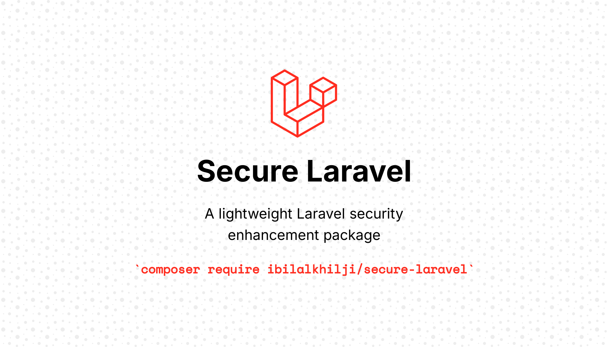

# 🔒 SecureLaravel



A lightweight Laravel security enhancement package by **Bilal Khilji** — designed to add advanced licensing, authorization, and integrity protection layers to your Laravel applications.

---

## 🚀 Features

* 🧩 Plug-and-play **Laravel Service Provider**
* 🦪 **License validation and encryption**
* 🔥 **Machine fingerprinting** support
* 🌐 **IP, domain, and usage tracking**
* 🧱 **Pre-boot protection** for unauthorized copies
* ⚙️ Helper functions for secure key management
* 🦦 Zero configuration — autoloaded via Composer

---

## 📦 Installation

Require the package via Composer:

```bash
composer require ibilalkhilji/secure-laravel
```

---

## ⚙️ Configuration

After installation, the service provider is automatically registered.

If you want to publish the configuration file:

```bash
php artisan vendor:publish --provider="Ibilalkhilji\SecureLaravel\SecurityServiceProvider" --tag="config"
```

This will create a configuration file at:

```
config/secure-laravel.php
```

Here, you can customize license verification endpoints, encryption settings, and key file paths.

---

## 🧠 Usage

### 1️⃣ Register License

You can register or verify your license key using the helper:

```php
use Ibilalkhilji\SecureLaravel\Facades\SecureLaravel;

SecureLaravel::validateLicense('YOUR-LICENSE-KEY');
```

### 2️⃣ Retrieve Machine Fingerprint

Get a unique hash based on system and environment data:

```php
$fingerprint = SecureLaravel::fingerprint();
```

### 3️⃣ Track Usage

Record usage meta for your application:

```php
SecureLaravel::track([
    'ip' => request()->ip(),
    'user_agent' => request()->userAgent(),
]);
```

---

## 🧪 Helper Functions

| Function                | Description                      |
| ----------------------- | -------------------------------- |
| `secure_check()`        | Validates if the app is licensed |
| `secure_fingerprint()`  | Returns system fingerprint       |
| `secure_encrypt($data)` | Encrypts data with package key   |
| `secure_decrypt($data)` | Decrypts data securely           |

---

## 🧙‍♂️ Folder Structure

```
src/
 ├── Facades/
 ├── Http/
 ├── Services/
 ├── Traits/
 ├── Helpers/helpers.php
 └── SecurityServiceProvider.php
```

---

## 🔐 Example Middleware

You can use the provided middleware to protect routes:

```php
Route::middleware(['secure.license'])->group(function () {
    Route::get('/dashboard', [DashboardController::class, 'index']);
});
```

---

## 🧑‍💻 Author

**Bilal Khilji**
📧 [kbinfo4u@gmail.com](mailto:kbinfo4u@gmail.com)
🌍 [GitHub: ibilalkhilji](https://github.com/ibilalkhilji)

---

## 📜 License

This package is open-sourced software licensed under the [MIT license](LICENSE).

---

## 💡 Notes

If you’re building a SaaS or distributed Laravel product, this package is ideal for embedding robust licensing and usage validation directly into your codebase.

---
